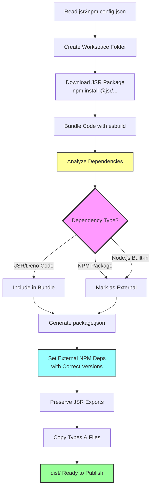

# JSR to NPM Converter

> **Bridge the gap**: Publish JSR packages to NPM with zero hassle

We can publish JSR packages with npm deps, but not vice versa, so **jsr2npm** fills the gap by converting JSR packages to NPM-compatible format.

## ✨ Key Features

- 🎯 **Zero Configuration** - Works out of the box, just specify package name and version
- 📦 **Preserves JSR Exports** - Keeps your original module structure intact
- 🔧 **CLI Tools Support** - Add executable commands with simple `bin` configuration
- 🚀 **Smart Bundling** - Bundles JSR/Deno code while keeping NPM deps external
- 📝 **Type Definitions** - Automatically copies TypeScript declarations
- 🔄 **CI/CD Ready** - Easy GitHub Actions integration for automated publishing
- 💎 **Clean & Simple** - Minimal config, maximum clarity

## Why jsr2npm?

JSR is great for publishing TypeScript/Deno packages, but the NPM ecosystem is still huge.

Many developers want to:
- Publish CLI tools that work with `npx`
- Make their JSR packages available on NPM
- Support both ecosystems without maintaining duplicate code
- Write pure TypeScript with Deno, publish to NPM

**jsr2npm** automates this entire process while preserving your package structure and metadata.

## How to Use

1.  **Create a `jsr2npm.config.json` file:**

    ### Basic Package (Uses JSR exports as-is)
    ```json
    {
      "packages": [
        {
          "name": "@scope/package",
          "version": "1.0.0",
          "packageJson": {
            "name": "@myorg/package",
            "description": "Package description"
          }
        }
      ]
    }
    ```

    ### CLI Tool (Adds bin command)
    ```json
    {
      "packages": [
        {
          "name": "@scope/cli-tool",
          "version": "1.0.0",
          "bin": {
            "your-command": "src/bin.ts"
          },
          "packageJson": {
            "name": "@myorg/cli-tool",
            "description": "Your CLI tool description"
          }
        }
      ]
    }
    ```

    **Configuration:**
    - `name` (required): JSR package name
    - `version` (required): JSR package version
    - `bin` (optional): CLI commands to add
      - Key: command name (e.g., "mycli")
      - Value: source file path (e.g., "src/bin.ts")
      - Bundles to `bin/{command}.mjs` automatically
      - **JSR exports are preserved completely**
    - `packageJson` (optional): Override package.json fields

    **Available `packageJson` overrides:**
    - `name`: NPM package name (recommended, e.g., "@myorg/cli-tool")
    - `version`: Override the package version
    - `description`: Override package description
    - `author`: Override author (string or object with name/email/url)
    - `license`: Override license
    - `homepage`: Override homepage URL
    - `repository`: Override repository (string or object with type/url)
    - `keywords`: Override keywords array
    - `scripts`: Merge additional scripts

2.  **Run the script:**
    ```bash
    deno run --allow-all cli.ts
    ```

    Or use the remote version:
    ```bash
    deno run --allow-all https://raw.githubusercontent.com/yaonyan/jsr2npm/main/cli.ts
    ```

## How It Works



The script automates these steps:

1.  **Create Workspace** - Creates `__scope__package_version/` folder for organization
2.  **Download JSR Package** - Uses `npm install` to fetch the package from JSR registry
3.  **Bundle with esbuild** - Processes the code and intelligently handles dependencies
4.  **Analyze Dependencies** - **Core feature**: Separates different types of dependencies:
    - **JSR/Deno code**: Bundled into the output
    - **NPM packages**: Marked as external dependencies
    - **Node.js built-ins**: Marked as external
5.  **Generate package.json** - Creates NPM metadata with:
    - **External NPM dependencies with correct versions** (automatically detected)
    - Preserved JSR `exports` field
    - Type definitions paths
    - `bin` field for CLI commands (if configured)
6.  **Copy Files** - Includes TypeScript declarations, README, and LICENSE
7.  **Output** - Ready-to-publish NPM package in `dist/` folder

## Requirements

*   [Deno](https://deno.land/)
*   [Node.js](https://nodejs.org/) (which includes `npx`)

## Usage

### Local Development

Run the conversion locally:

```bash
deno run -A cli.ts
```

Or use the remote version:

```bash
deno run -A https://raw.githubusercontent.com/yaonyan/jsr2npm/main/cli.ts
```

The converted packages will be in `__<scope>__<package>_<version>/dist/` directories.

### Publishing to npm

After conversion, you can publish manually:

```bash
# For a single package
cd __scope__package_version/dist
npm publish --access public

# For multiple packages (skip if already published)
for dir in __*_*/dist; do
  cd "$dir"
  NAME=$(node -p "require('./package.json').name")
  VERSION=$(node -p "require('./package.json').version")
  
  if npm view "$NAME@$VERSION" version 2>/dev/null; then
    echo "Skipping $NAME@$VERSION (already published)"
  else
    npm publish --access public
  fi
  cd ../..
done
```
```

---

## Setting up Automated CI/CD (For Package Maintainers)

If you maintain a JSR package with CLI tools and want to automatically publish npm versions, follow these steps:

### Step 1: Add jsr2npm Config to Your Repository

Create `jsr2npm.config.json` in your JSR package repository root:

```json
{
  "packages": [
    {
      "name": "@your-scope/your-package",
      "version": "0.1.0",
      "bin": {
        "your-command": "src/cli.ts"
      },
      "packageJson": {
        "name": "@npm-org/package-name",
        "description": "Your package description"
      }
    }
  ]
}
```

### Step 2: Create GitHub Workflow

Create `.github/workflows/publish-npm.yml`:

```yaml
name: Publish CLI to NPM

on:
  workflow_dispatch:
  push:
    tags:
      - 'v*'

jobs:
  convert-and-publish:
    runs-on: ubuntu-latest
    
    permissions:
      contents: write
      id-token: write

    steps:
      - name: Checkout repository
        uses: actions/checkout@v4

      - name: Setup Deno
        uses: denoland/setup-deno@v2
        with:
          deno-version: v2.x

      - name: Setup Node.js
        uses: actions/setup-node@v4
        with:
          node-version: '20'
          registry-url: 'https://registry.npmjs.org'

      - name: Run JSR to NPM conversion
        run: deno run -A https://raw.githubusercontent.com/yaonyan/jsr2npm/main/cli.ts

      - name: Publish to npm
        run: |
          for dir in __*_*/dist; do
            cd "$dir"
            NAME=$(node -p "require('./package.json').name")
            VERSION=$(node -p "require('./package.json').version")
            
            if npm view "$NAME@$VERSION" version 2>/dev/null; then
              echo "Skipping $NAME@$VERSION (already published)"
            else
              npm publish --access public --provenance
            fi
            cd ../..
          done
        env:
          NODE_AUTH_TOKEN: ${{ secrets.NPM_TOKEN }}

      - name: Upload artifacts
        uses: actions/upload-artifact@v4
        with:
          name: npm-package
          path: __*_*/dist/
          retention-days: 7
```

### Step 3: Add NPM Token

1. Go to [npmjs.com](https://www.npmjs.com/) → Account Settings → Access Tokens
2. Create a new **Automation** token
3. Add to your GitHub repository: Settings → Secrets → Actions → New repository secret
   - Name: `NPM_TOKEN`
   - Value: Your npm token

### Step 4: Trigger Publishing

**Before publishing, update the version in `jsr2npm.config.json` to match your release.**

Then trigger the workflow:

**Option A: Manual trigger**
- Go to Actions tab → "Publish CLI to NPM" → Run workflow

**Option B: Tag and push**
```bash
# Update version in jsr2npm.config.json first!
git add jsr2npm.config.json
git commit -m "Release v1.0.0"
git tag v1.0.0
git push origin main --tags
```

Done! Your package will be published to npm.

---

## Example Output

After conversion, you'll have a structure like:

```
__scope__package_1.0.0/
├── node_modules/          (JSR package and dependencies)
└── dist/                  (Ready to publish)
    ├── package.json       (Generated for npm, preserves JSR exports)
    ├── bin/               (CLI tools, if configured)
    │   └── command.mjs    (Bundled executable)
    ├── types/             (TypeScript declarations)
    │   └── mod.d.ts
    ├── README.md          (Copied from source)
    └── LICENSE            (Copied from source)
```
