# JSR to NPM Converter

This is a command-line tool to convert JSR packages into a format that can be published to NPM. It handles bundling the code, extracting NPM dependencies, and creating a valid `package.json`.

## How to Use

1.  **Create a `jsr2npm.config.json` file:**

    ### CLI Tool Configuration (Recommended)
    ```json
    {
      "packages": [
        {
          "name": "@scope/cli-tool",
          "version": "1.0.0",
          "packageJson": {
            "name": "@myorg/cli-tool",
            "description": "A CLI tool",
            "bin": {
              "my-command": "./bin/cli.mjs"
            }
          }
        }
      ]
    }
    ```

    ### Library with Multiple Entry Points
    ```json
    {
      "packages": [
        {
          "name": "@scope/package-name",
          "version": "1.0.0",
          "entrypoints": ["mod.ts", "plugins.ts", "utils.ts"],
          "packageJson": {
            "name": "@myorg/custom-name",
            "description": "Custom package description"
          }
        }
      ]
    }
    ```

    **Configuration Options:**
    - `name`: JSR package name (e.g., "@scope/package")
    - `version`: Package version
    - `entrypoints`: (Optional) Array of entry files to bundle. If not specified, will use `deno.json` exports
    - `packageJson.bin`: Define CLI commands. The tool will automatically bundle the referenced files

    **Configuration Options:**
    - `name`: JSR package name (e.g., "@scope/package")
    - `version`: Package version
    - `entrypoints`: (Optional) Array of entry files to bundle. If not specified, will use `deno.json` exports
    - `packageJson.bin`: Define CLI commands. The tool will automatically bundle the referenced files

    **Available `packageJson` overrides:**
    - `name`: Override the package name (default: `@jsr2npm/original-name`)
    - `version`: Override the package version
    - `description`: Override package description
    - `author`: Override author (string or object with name/email/url)
    - `license`: Override license
    - `homepage`: Override homepage URL
    - `repository`: Override repository (string or object with type/url)
    - `keywords`: Override keywords array
    - `bin`: Define CLI commands (e.g., `{"my-cli": "./bin/cli.mjs"}`)
    - `scripts`: Merge additional scripts (keeps the default `start` script)

2.  **Run the script:**
    ```bash
    deno run --allow-all cli.ts
    ```

    Or use the remote version:
    ```bash
    deno run --allow-all https://raw.githubusercontent.com/yaonyan/jsr2npm/main/cli.ts
    ```

## How It Works

```mermaid
flowchart TD
    A[📋 Read jsr2npm.config.json] --> B[📦 For each package]
    B --> C[📁 Create workspace folder<br/>__scope__package_version]
    C --> D[🔄 Install JSR package<br/>via npx jsr add]
    D --> E{Check entrypoints}
    E -->|From config| F[📄 Use configured entrypoints]
    E -->|Auto detect| G[📄 Read from deno.json exports]
    F --> H[🔨 Bundle with esbuild]
    G --> H
    H --> I[📦 Separate JSR/Deno code<br/>from NPM dependencies]
    I --> J[📝 Extract external dependencies]
    J --> K{Has bin config?}
    K -->|Yes| L[🔧 Bundle CLI files<br/>Set executable permissions]
    K -->|No| M[📋 Generate package.json]
    L --> M
    M --> N[📄 Copy README, LICENSE<br/>and type declarations]
    N --> O[✅ Ready to publish!<br/>dist/ folder]
    
    style A fill:#e1f5ff
    style O fill:#c8e6c9
    style H fill:#fff9c4
    style M fill:#fff9c4
```



## What It Does

The script automates the following steps:

1.  **Creates a Workspace:** It makes a new folder named `_<scope>_<name>_<version>` to keep the conversion files organized.

2.  **Fetches the JSR Package:** It uses `npx jsr add` to download the specified JSR package and its Deno dependencies.

3.  **Bundles the Code:**
    *   It uses `esbuild` to bundle the JSR package into one or more ESM files
    *   Reads entry points from `deno.json` exports or `entrypoints` config
    *   For CLI tools, bundles files referenced in `packageJson.bin`
    *   It intelligently separates JSR/Deno-native code from third-party NPM packages. JSR packages and relative files are included in the bundle, while NPM packages and Node.js built-ins are marked as external.

4.  **Generates `package.json`:**
    *   It reads metadata from both `package.json` and `deno.json` files
    *   It preserves important metadata like name, version, description, author, license, repository, keywords, and homepage from `deno.json`
    *   It identifies all external NPM dependencies that were excluded from the bundle
    *   It looks up the versions for these dependencies from the `package-lock.json` file
    *   It generates a new `package.json` in the `dist` folder with:
      - Correct NPM dependencies
      - `exports` field mapping entry points
      - `bin` field for CLI tools (auto-generated from "bin" type entries)
      - Type declarations paths
      - Basic `start` script
    *   Config overrides take precedence over both `package.json` and `deno.json` values

5.  **Copies Auxiliary Files:** It copies important files like `README.md` and `LICENSE` from the original JSR package into the final `dist` directory.

6.  **Final Output:** The final, ready-to-publish NPM package is placed in the `dist` directory inside the conversion folder.

## Requirements

*   [Deno](https://deno.land/)
*   [Node.js](https://nodejs.org/) (which includes `npx`)

## Usage

### Local Development

Run the conversion locally:

```bash
deno run -A cli.ts
```

Or use the remote version:

```bash
deno run -A https://raw.githubusercontent.com/yaonyan/jsr2npm/main/cli.ts
```

The converted packages will be in `__<scope>__<package>_<version>/dist/` directories.

### Publishing to npm

After conversion, you can publish manually:

```bash
cd __mcpc__cli_0.1.1/dist
npm publish --access public
```

---

## Setting up Automated CI/CD (For Package Maintainers)

If you maintain a JSR package with CLI tools and want to automatically publish npm versions, follow these steps:

### Step 1: Add jsr2npm Config to Your Repository

Create `jsr2npm.config.json` in your JSR package repository root:

```json
{
  "packages": [
    {
      "name": "@your-scope/your-package",
      "version": "0.1.0",
      "packageJson": {
        "name": "@npm-org/package-name",
        "description": "Your package description",
        "bin": {
          "your-command": "./bin/cli.mjs"
        }
      }
    }
  ]
}
```

### Step 2: Create GitHub Workflow

Create `.github/workflows/publish-npm.yml`:

```yaml
name: Publish CLI to NPM

on:
  workflow_dispatch:
  push:
    tags:
      - 'v*'

jobs:
  convert-and-publish:
    runs-on: ubuntu-latest
    
    permissions:
      contents: write
      id-token: write

    steps:
      - name: Checkout repository
        uses: actions/checkout@v4

      - name: Setup Deno
        uses: denoland/setup-deno@v2
        with:
          deno-version: v2.x

      - name: Setup Node.js
        uses: actions/setup-node@v4
        with:
          node-version: '20'
          registry-url: 'https://registry.npmjs.org'

      - name: Run JSR to NPM conversion
        run: deno run -A https://raw.githubusercontent.com/yaonyan/jsr2npm/main/cli.ts

      - name: Publish to npm
        run: |
          cd __*_*/dist
          npm publish --access public --provenance
        env:
          NODE_AUTH_TOKEN: ${{ secrets.NPM_TOKEN }}

      - name: Upload artifacts
        uses: actions/upload-artifact@v4
        with:
          name: npm-package
          path: __*_*/dist/
          retention-days: 7
```

### Step 3: Add NPM Token

1. Go to [npmjs.com](https://www.npmjs.com/) → Account Settings → Access Tokens
2. Create a new **Automation** token
3. Add to your GitHub repository: Settings → Secrets → Actions → New repository secret
   - Name: `NPM_TOKEN`
   - Value: Your npm token

### Step 4: Trigger Publishing

**Before publishing, update the version in `jsr2npm.config.json` to match your release.**

Then trigger the workflow:

**Option A: Manual trigger**
- Go to Actions tab → "Publish CLI to NPM" → Run workflow

**Option B: Tag and push**
```bash
# Update version in jsr2npm.config.json first!
git add jsr2npm.config.json
git commit -m "Release v1.0.0"
git tag v1.0.0
git push origin main --tags
```

Done! Your package will be published to npm.

---

## Example Output

After conversion, you'll have a structure like:

```
__scope__package_1.0.0/
├── node_modules/          (JSR package and dependencies)
└── dist/                  (Ready to publish)
    ├── package.json       (Generated for npm)
    ├── index.mjs          (Bundled code)
    ├── bin/
    │   └── cli.mjs        (CLI tool, if configured)
    ├── types/             (TypeScript declarations)
    │   └── mod.d.ts
    ├── README.md          (Copied from source)
    └── LICENSE            (Copied from source)
```
